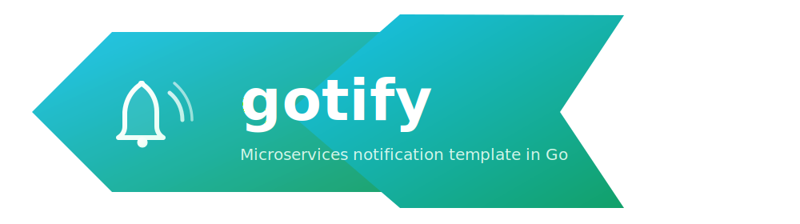
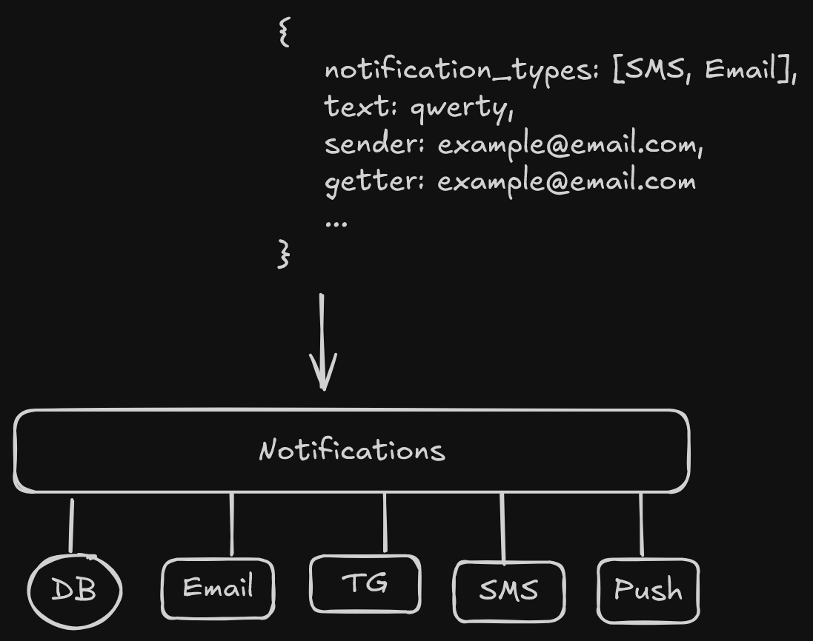

# Обзор

Шаблон демонстрационного веб-приложения на микросервисной архитектуре на Go
для отправки уведомлений через различные каналы: Email, SMS, Telegram и др.
Смысл данного проекта - показать как организовать сервисы, конфигурацию,
логирование и тестирование в Go.

## Технологии

- REST-API gateway
- Kafka - брокер сообщений
- PostgreSQL - БД
- Redis - сервис кеширования данных
- Grafana Loki - сервис логирования
- Grafana Prometheus - сервис мониторинга метрик
- Docker

## Архитектура

- API gateway (notifications) - сервис публикации запросов в очередь
- DB - сервис для хранения уведомлений в БД
- Email, TG, SMS, Push - сервисы отправки уведомления

## Roadmap

- [x] API gateway
- [x] Добавить Dockerfile
- [x] Добавить docker-compose
- [x] Добавить rabbitmq для email
- [ ] Чтение конфига из ~/.config/
- [ ] Добавить Kafka
- [ ] Добавить kubernetes
